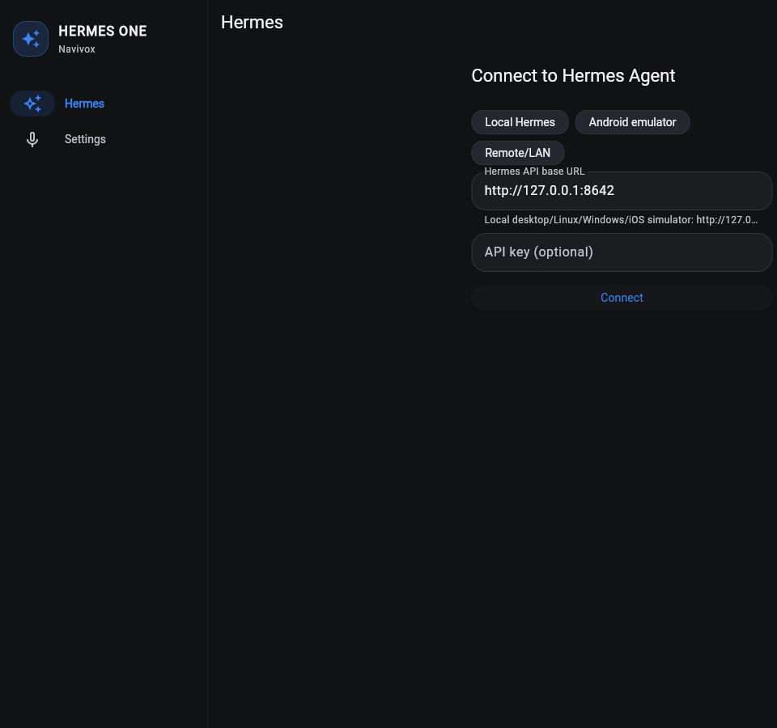

# Navivox

Experimental Flutter client for [Hermes Agent](https://github.com/NousResearch/hermes-agent).

Navivox connects to a trusted Hermes Agent API endpoint and provides session
chat, streamed assistant and tool activity, approval handling, endpoint
configuration, and optional speech input.

## Project status

Navivox is alpha software. It is currently distributed as source builds only;
no signed public binaries or store releases are published.



| Platform | Current evidence | Status |
| --- | --- | --- |
| Android | Debug build and optional emulator integration smokes | Experimental alpha |
| Web | Release build and fake-server browser smoke | Alpha, text-focused |
| Linux | Release build | Alpha, text-focused |
| Windows | Debug compilation | Build-tested only |
| iOS | Simulator debug compilation | Build-tested only |
| macOS | Debug compilation | Build-tested only |

Voice input requests on-device recognition from the operating system speech
service on Android, iOS, macOS, Windows, and web. Availability depends on the
device and installed recognizer; Linux voice input is unavailable. Continuous
voice is an opt-in application loop that rearms bounded recognition sessions,
not an always-on audio stream. A repeatable physical-device microphone receipt
has not yet been recorded.

## Hermes compatibility

Navivox negotiates behavior through `/v1/capabilities` instead of claiming a
fixed Hermes version range. A compatible server must provide `/health`,
`/v1/capabilities`, and the advertised session or run endpoints Navivox uses.
See the [compatibility contract](docs/product/hermes-compatibility.md) and the
[Hermes Agent repository](https://github.com/NousResearch/hermes-agent) for
server setup.

## Quick start

Prerequisites: Flutter 3.44.2 and the platform SDK for your target.

```bash
git clone https://github.com/TrebuchetDynamics/navivox-app.git
cd navivox-app
flutter pub get
flutter run -d <device-id>
```

Connect to one of these Hermes endpoints:

- Desktop on the same host: `http://127.0.0.1:8642`
- Android emulator to host: `http://10.0.2.2:8642`
- Physical device: an HTTPS, VPN, Tailscale, or isolated-LAN endpoint

Navivox asks for explicit confirmation before sending an API key to a
non-loopback plaintext HTTP endpoint.

## Privacy and transport

- API keys use the platform secure-storage implementation; hardware backing and
  backup behavior vary by platform.
- Endpoint metadata is stored separately in shared preferences.
- Recognized words are excluded from diagnostic logs.
- Navivox submits completed transcripts to Hermes as text and does not send the
  captured microphone audio through this path.
- Requesting on-device recognition does not prove that every operating-system
  recognizer works offline. Verify the recognizer and device policy you deploy.
- HTTPS is the default recommendation for remote endpoints. Plain HTTP can
  expose credentials and conversation data outside a trusted encrypted network.

See [SECURITY.md](SECURITY.md) and the [threat model](docs/security/threat-model.md).

## Known limitations

- No signed public packages or store distribution.
- No repeatable real-device microphone validation in ordinary CI.
- Windows, iOS, and macOS are compilation-tested, not release-supported.
- Hermes server audio and realtime audio are not wired; voice submits text.
- Optional Hermes inventory may be unavailable even when advertised; Navivox
  reports those retrieval failures separately from empty inventories.

## Development

```bash
dart format --output=none --set-exit-if-changed lib test integration_test
flutter analyze
flutter test --concurrency=1
flutter build web --release -t lib/main_e2e.dart
npm ci
npm run web:e2e
```

Optional offline text-to-speech uses the pinned `pocket_speech` package and
operator-selected Kitten or Kokoro voice packs.

See [CONTRIBUTING.md](CONTRIBUTING.md), [CHANGELOG.md](CHANGELOG.md), and the
[project documentation](docs/README.md).
