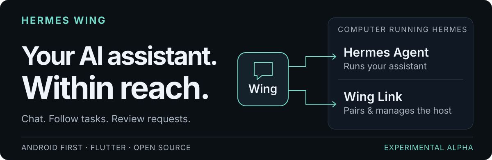

# Hermes Wing

**Use an AI assistant running on your computer from your Android phone.**
Chat, follow its work, and review requests for permission in a visual app.
Web and desktop versions are available too, with different setup requirements.

> [!NOTE]
> **Early alpha · technical setup required.** The main getting-started path needs
> an Android developer build, a Linux computer, and access to an AI provider.
> There is no app-store installation yet.

**[Set up your first chat →](docs/getting-started.md)**

  <picture>
    <source media="(max-width: 600px)" srcset="./assets/readme/overview-mobile.svg">
    
  </picture>

## What is Hermes Agent?

[Hermes Agent](https://github.com/NousResearch/hermes-agent) is open-source
software for running a personal AI assistant. An **agent** can take actions as
well as write replies—for example, working with files or running commands when
you have configured the necessary tools and permissions.

**Hermes Wing is the app you use to talk to it.** You do not need to know Hermes
before starting: the setup guide covers installing the assistant too.

| Piece | Its job |
| --- | --- |
| **Wing** | The app you open to chat and follow work. |
| **Hermes Agent** | Runs the assistant and keeps its conversations on your computer. |
| **Wing Link** | Handles computer setup, pairing, and supported host-management tasks. |

Chat goes directly from Wing to Hermes Agent, separately from Wing Link.
Hermes remains the source of truth.

## What can I do with it?

Start with a conversation:

> Help me turn my website idea into three practical steps. Ask me what you need to know first.

Answer its questions, then follow up with “Turn the first step into a checklist.”
You can return to the conversation later.

- **Chat and follow progress.** Read replies as they arrive and see tool activity.
- **Stay in control.** Review permission requests when Hermes sends them, or stop
  the current task.
- **Keep assistant setups separate.** Switch between named configurations,
  called **profiles**. Start with **Default**.

  <picture>
    <source media="(max-width: 600px)" srcset="./assets/readme/showcase-mobile.png">
    
  </picture>

*Actual app screens with sample conversations and simulated responses.*

## What do I need?

- **A Linux computer that stays on and reachable.** This is where Hermes runs.
- **An Android phone and the tools to build Wing.** The guide explains the
  requirements; someone comfortable with terminal commands may need to help.
- **An AI provider and model.** The provider supplies the AI service; the model
  generates replies. Hermes' setup wizard helps you configure them.
- **NetBird or Tailscale on both devices** for the guide's private-network pairing path.

Wing is [MIT-licensed](LICENSE). **AI access and credits are not included**;
providers may charge and process conversation data. Hosting Hermes yourself does
not automatically keep every AI request local.

## Your first chat

1. **Build and open Wing.** Choose **Use another computer**.
2. **Prepare your Linux computer.** Install Wing Link, which can install Hermes
   or reuse a supported installation. Configure your AI provider in Hermes.
3. **Pair your phone.** Create a pairing link on the computer, review its identity
   in Wing, and confirm. Pairing gives your phone permission to connect.
4. **Open Default and send a message:** “Reply with one sentence introducing
   yourself. Do not use any tools.” A reply confirms chat works. Try a follow-up.

**[Follow the step-by-step setup guide →](docs/getting-started.md)**

Already running Hermes? Start with the [connection steps](docs/getting-started.md#3-connect-your-phone).

Just looking? [Try the web alpha](https://trebuchetdynamics.github.io/hermes-wing/app/).
**Interface only—requires your own assistant to chat.** Browser connections also
need trusted HTTPS and permission for the Wing website to contact your computer;
see [browser connection help](docs/getting-started.md#need-help).

## Availability

Android is the most exercised client. Web and Linux are text-first alpha paths;
Windows, macOS, and iOS have build evidence but limited runtime qualification.
Voice and [phone-only hosting with Termux](docs/runbooks/android-termux-local-agent.md)
are experimental. There are no signed app packages or automatic updates yet.

See [feature availability](docs/product/routes.md) and
[real Android chat test evidence](docs/quality/provider-chat-physical-2026-09-05.md)
for the tested scope.

## Need help?

Cannot connect, expired pairing link, or paired without a reply?
[Start with troubleshooting](docs/getting-started.md#need-help).
If you [report a problem](https://github.com/TrebuchetDynamics/hermes-wing/issues),
include your platform and what happened. Keep credentials, pairing links, and
private conversations out of reports.

[All documentation](docs/README.md) · [Contributing](CONTRIBUTING.md) ·
[Roadmap](ROADMAP.md) · [Security](SECURITY.md) · [Changelog](CHANGELOG.md)

Hermes Wing is independent of NousResearch. Thanks to
[Hermes Agent](https://github.com/NousResearch/hermes-agent) for the runtime and
[Hermes Desktop](https://github.com/fathah/hermes-desktop) for interaction and setup inspiration.
