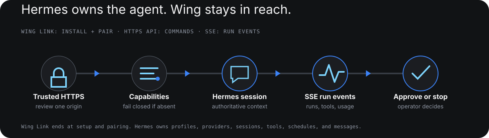

# Hermes Wing

<p align="center">
  
</p>

<p align="center">
  <a href="https://github.com/TrebuchetDynamics/hermes-wing/actions/workflows/hermes-platform-smoke.yml"></a>
  <a href="#project-status"></a>
  <a href="LICENSE"></a>
</p>

<p align="center">
  
</p>

<p align="center"><sub>Real repository fixtures: desktop run controls and mobile gateway inventory.</sub></p>

> [!IMPORTANT]
> Hermes Wing is independent, source-distributed alpha software. There are no
> signed public binaries or store releases yet.

Hermes Wing is an independent cross-platform Flutter client for trusted
[Hermes Agent](https://github.com/NousResearch/hermes-agent) endpoints. It keeps
sessions, streamed runs, tool activity, approvals, profiles, and optional device
speech in reach without reading Hermes files or becoming a second backend.
Inspired by [Hermes Desktop](https://github.com/fathah/hermes-desktop)'s
operator-first breadth, Wing adapts that idea to Android, web, and desktop while
keeping Hermes Agent authoritative through its
[advertised compatibility contract](docs/product/hermes-compatibility.md).

## Why Wing

| Need                         | What Wing does                                                                                                     |
| ---------------------------- | ------------------------------------------------------------------------------------------------------------------ |
| **Stay with active work**    | Keeps concurrent, session-owned streams attached while you move between sessions and gateways                      |
| **Keep control visible**     | Shows reasoning bounds, tool events, usage, approvals, retry, diagnostics, and stop controls in the owning session |
| **Use the device you have**  | Adapts one client to compact mobile chat and desktop workspaces, with review-first local voice input               |
| **Respect server authority** | Negotiates `/v1/capabilities` and hides or isolates operations the endpoint did not advertise                      |

## Trust path

<p align="center">
  <picture>
    <source media="(max-width: 600px)" srcset="./assets/readme/runtime-flow-mobile.svg">
    
  </picture>
</p>

HTTP carries commands and resources; SSE carries typed run events. Hermes Agent
remains authoritative for sessions, tools, profiles, runs, approvals, and
configuration. Reconnect refreshes capabilities and authoritative state instead
of replaying local mutations.

## Start from source

Prerequisites: **Flutter 3.44.2**, the SDK for your target platform, and a
reachable Hermes Agent endpoint.

```bash
git clone https://github.com/TrebuchetDynamics/hermes-wing.git
cd hermes-wing
flutter pub get
flutter run -d <device-id>
```

Enter a trusted endpoint in **Connect to Hermes**, or use one of these common
origins:

| Target                            | Endpoint example                           |
| --------------------------------- | ------------------------------------------ |
| Same desktop host                 | `http://127.0.0.1:8642`                    |
| Android emulator → host           | `http://10.0.2.2:8642`                     |
| Physical device or remote desktop | HTTPS, VPN, Tailscale, or isolated LAN URL |

Hermes Wing asks for explicit confirmation before sending a bearer credential
to a non-loopback plaintext HTTP endpoint.

## Pair Android safely

Install the host helper on the machine running Hermes Agent:

```bash
./install-wing-cli.sh
wing-cli info
wing-cli qr
```

Then open **Connect to Hermes → Scan QR code**, review the endpoint and access,
and connect. `wing-cli qr` uses a short-lived, single-use compatibility handoff:
the QR does not contain the API key, but the resulting credential has the
configured `API_SERVER_KEY` superuser access. If the endpoint advertises scoped
enrollment, use `wing-cli link` to request a short-lived scoped `wing://` link.

| Helper command   | Purpose                                                              |
| ---------------- | -------------------------------------------------------------------- |
| `wing-cli info`  | Show the Tailscale address and endpoint without revealing a token    |
| `wing-cli qr`    | Render the temporary Android pairing handoff                         |
| `wing-cli link`  | Request a scoped pairing link from an advertised enrollment endpoint |
| `wing-cli token` | Explicitly reveal the superuser key for manual developer setup       |

The helper uses Bash and Python 3. Run `wing-cli help` for origin, label, scope,
and environment overrides. See the [Android setup guide](docs/runbooks/android-hermes-setup.md)
for the full path.

## Capabilities today

| Area                       | Current surface                                                                                                                               |
| -------------------------- | --------------------------------------------------------------------------------------------------------------------------------------------- |
| **Sessions and runs**      | History, search, rename, branching, bounded bulk deletion, portable transcript export, concurrent streams, retry, usage, and stop             |
| **Operator controls**      | Session-owned tool progress, approval review, approve/deny actions, bounded diagnostics, and redacted error details                           |
| **Gateways and Office**    | Multiple saved endpoints, activity-ordered profile contacts, health/session summaries, direct chat, and cached non-secret offline summaries   |
| **Profiles and inventory** | Capability-gated profiles, providers/models, installed skills, toolsets, schedules, and gateway readiness; unsupported operations fail closed |
| **Device speech**          | One-step speak-and-send or long-press dictation for review, plus optional reply TTS and Pocket Speech voice packs                             |
| **Adaptive client**        | Android, web, Linux, Windows, iOS, and macOS targets from one Flutter codebase with light/dark palette support                                |

Voice input requests the operating system recognizer and submits completed text,
not captured microphone audio. Optional local TTS uses the pinned
[`pocket_speech`](https://github.com/TrebuchetDynamics/pocket-speech-dart)
package with operator-selected Kitten or Kokoro voice packs.

## Project status

The [Hermes Desktop parity ledger](docs/product/hermes-desktop-parity.md) is the
canonical source for capability status and evidence.

| Platform | Current evidence                                                                         | Status              |
| -------- | ---------------------------------------------------------------------------------------- | ------------------- |
| Android  | Debug build plus physical chat/session, lifecycle, Office, inventory, and voice receipts | Experimental alpha  |
| Web      | Release build and deterministic browser smoke                                            | Alpha, text-focused |
| Linux    | Release build plus native-shell and transcript-context-menu receipts                     | Alpha, text-focused |
| Windows  | Cross-target native Settings/About/window/full-screen syntax check                       | Build-tested only   |
| iOS      | Simulator debug compilation                                                              | Build-tested only   |
| macOS    | Debug compilation plus native Settings menu bridge                                       | Build-tested only   |

### Current limits

- No signed packages, store distribution, or supported release line.
- Windows, iOS, and macOS are compilation-tested rather than release-supported.
- Linux voice input is unavailable; recognizer availability and offline behavior
  vary by device and operating-system policy.
- Hermes server audio/realtime audio, remote transcript media, and client-path
  attachments are not wired.
- Optional inventories can be unavailable independently of chat; the UI does not
  present missing authorization or contracts as an empty result.
- Hermes Wing has not received an independent security audit.

Bearer credentials use each platform's secure-storage implementation, whose
hardware backing and backup behavior vary. Prefer HTTPS for remote endpoints;
plaintext HTTP can expose credentials and conversations outside a trusted
encrypted network. Read [SECURITY.md](SECURITY.md) and the
[threat model](docs/security/threat-model.md) before use outside a local or
private encrypted network.

## Development

```bash
dart format --output=none --set-exit-if-changed lib test integration_test
flutter analyze
flutter test --concurrency=1
flutter build web --release -t lib/main_e2e.dart
npm ci
npm run web:e2e
npm audit
```

## Documentation

- [Roadmap](ROADMAP.md)
- [Documentation index](docs/README.md)
- [Hermes compatibility contract](docs/product/hermes-compatibility.md)
- [Gateway profile management](docs/product/gateway-profile-management.md)
- [Architecture decisions](docs/adr/README.md)
- [Alpha release runbook](docs/runbooks/release-alpha.md)
- [Contributing](CONTRIBUTING.md)
- [Changelog](CHANGELOG.md)

## License

Hermes Wing is available under the [MIT License](LICENSE).
