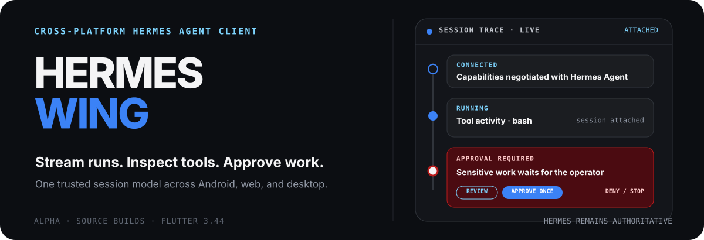
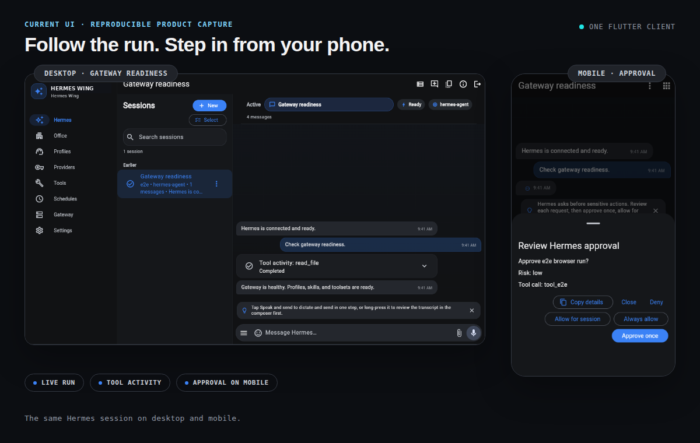

# Hermes Wing

<p align="center">
  
</p>

<p align="center">
  <a href="https://trebuchetdynamics.github.io/hermes-wing/app/"><strong>Try the web alpha</strong></a>
  ·
  <a href="#build-the-alpha-from-source"><strong>Build Android from source</strong></a>
  ·
  <a href="docs/README.md"><strong>Read the documentation</strong></a>
</p>

<p align="center">
  <a href="https://github.com/TrebuchetDynamics/hermes-wing/actions/workflows/hermes-platform-smoke.yml"></a>
  <a href="#project-status"></a>
  <a href="LICENSE"></a>
</p>

## Control Hermes Agent from your phone

Hermes Wing is an independent, Android-first Flutter client for staying attached
to [Hermes Agent](https://github.com/NousResearch/hermes-agent) away from your
desk. Continue conversations, follow tool activity, answer approval requests, and
switch between trusted Hermes gateways from one app.

Start a long task on your workstation, step away, and keep control from your
phone. Wing is the interface; Hermes remains the source of truth for sessions,
tools, approvals, profiles, and configuration.

> [!NOTE]
> Hermes Wing is alpha software. Android is the best-tested client today. Signed
> packages and app-store releases are not available yet.

<p align="center">
  <picture>
    <source media="(max-width: 600px)" srcset="./assets/readme/showcase-mobile.png">
    
  </picture>
</p>

<p align="center"><sub>A Hermes run on desktop and an approval request in the mobile layout.</sub></p>

## What works today

- **Stay with long-running work.** Follow streaming replies, Markdown, reasoning,
  tool activity, and token usage while moving between sessions.
- **Intervene when it matters.** Review tool requests, approve once or for the
  session, deny them, retry failed work, or stop the active run.
- **Reach multiple agents.** Save trusted Hermes gateways, browse session history,
  and switch between profiles without moving agent state onto the device.
- **Talk naturally.** Dictate messages and optionally hear replies on supported
  Android devices. Voice remains experimental and device-dependent.
- **Use the same client elsewhere.** Web and Linux builds cover the text-first
  experience; Windows, macOS, and iOS are earlier platform targets.

Hermes Agent is a self-hosted AI agent with tools, persistent sessions, profiles,
and messaging gateways. Wing adds a dedicated visual client for conversations,
run activity, approvals, configuration, and voice.

## Try it

### Web alpha

[Open the web alpha](https://trebuchetdynamics.github.io/hermes-wing/app/) to
explore the current interface. To connect it to your own Hermes host, that host
must be reachable from the browser and configured for the web origin.

### Build the alpha from source

You need Flutter 3.44.2, the SDK for your target platform, and a reachable Hermes
Agent API endpoint.

```bash
git clone https://github.com/TrebuchetDynamics/hermes-wing.git
cd hermes-wing
flutter pub get
flutter devices
flutter run -d <device-id>
```

This starts a development build. For a release APK:

```bash
flutter build apk --release
adb install -r build/app/outputs/flutter-apk/app-release.apk
```

When Wing opens, choose **Connect to Hermes** and enter the API URL and credential
configured for your Hermes gateway. Existing Hermes users can keep their current
server and credential. For a new host, use the setup path below.

Common development endpoints:

| Hermes location | Endpoint |
| --- | --- |
| Same desktop | `http://127.0.0.1:8642` |
| Host from Android emulator | `http://10.0.2.2:8642` |
| Private LAN or VPN | `http://<trusted-host-ip>:8642` |
| Remote HTTPS host | `https://<your-hermes-host>` |

Prefer HTTPS when traffic leaves the local machine. Wing asks before sending a
credential over non-loopback plaintext HTTP.

### Set up a Hermes host and pair Android

[Wing Link](wing_link/) is the optional host-local setup and pairing helper. It
can install or adopt the pinned Hermes Agent build, prepare authentication, start
the gateway, and create a short-lived pairing QR code.

The host needs Git, Go 1.26 or newer, and network access for the pinned Hermes
installer. Persistent Wing Link service management is currently implemented for
Linux with a per-user systemd service.

```bash
git clone https://github.com/TrebuchetDynamics/hermes-wing.git
cd hermes-wing
./install-wing-link.sh --build
~/.local/bin/wing-link setup
hermes setup
hermes gateway restart
```

The installer defaults to `~/.local/bin`; add it to `PATH` if you prefer the
unqualified `wing-link` command. Profile, provider, and model setup belongs to
Hermes-owned interfaces. Deprecated Wing Link profile/provider adapters remain
compiled only for rollback compatibility and their routes are disabled. After
Hermes is ready, pair the phone:

```bash
WING_HERMES_URL=http://<trusted-host-ip>:8642 \
WING_LINK_URL=http://<trusted-host-ip>:8654 \
~/.local/bin/wing-link pair
```

Scan the code from **Connect to Hermes → Scan QR code**, review the origins and
requested access, then confirm. The pairing code is single-use, expires after five
minutes, and contains no bearer credential.

See [Android Hermes setup](docs/runbooks/android-hermes-setup.md) for VPN routing,
firewalls, service management, and recovery.

## The three pieces

- **Hermes Wing** is the Flutter client on Android, web, and desktop.
- **Wing Link** is an optional local helper for installation, pairing, service
  lifecycle, health, and diagnostics. Deprecated domain adapters are disabled.
- **Hermes Agent** owns the agent runtime and its sessions, profiles, tools,
  providers, approvals, and configuration.

Wing connects to the Hermes HTTPS API and SSE event stream. It does not read
Hermes files or keep a second copy of agent state. The
[compatibility contract](docs/product/hermes-compatibility.md) documents the API,
permissions, and version behavior.

## Security

Wing stores credentials through platform secure storage, never puts bearer
credentials in pairing QR codes, and does not replay administrative changes after
a reconnect. Provider keys are write-only in Wing. Use HTTPS or a trusted encrypted
network for remote access.

Read [SECURITY.md](SECURITY.md) and the
[threat model](docs/security/threat-model.md) before exposing Hermes beyond a
private network. Hermes Wing has not received an independent security audit.

## Project status

| Platform | Current state |
| --- | --- |
| Android | Experimental alpha and the best-tested runtime target. |
| Web | Public text-first alpha with release builds and browser smoke tests. |
| Linux | Text-first alpha with release builds and native shell checks. |
| Windows | Build-tested; no supported package. |
| iOS | Simulator build-tested. |
| macOS | Build-tested; no supported package. |

There are no signed packages, store releases, automatic updates, or supported
release line yet. Compilation on Windows, iOS, and macOS does not establish
runtime support. Physical microphone quality, echo cancellation, and barge-in
still require device testing.

## Contributing and documentation

The repository contains a Flutter client and a Go-based Wing Link helper. Start
with [CONTRIBUTING.md](CONTRIBUTING.md) for the repository map, fixture workflow,
required checks, and current contribution guidance.

- [Documentation index](docs/README.md)
- [Android setup](docs/runbooks/android-hermes-setup.md)
- [Hermes compatibility](docs/product/hermes-compatibility.md)
- [Architecture decisions](docs/adr/README.md)
- [Roadmap](ROADMAP.md)
- [Changelog](CHANGELOG.md)

Hermes Wing takes inspiration from
[Hermes Desktop](https://github.com/fathah/hermes-desktop), particularly its
clear local and remote setup and visual product tour.

## License

Hermes Wing is available under the [MIT License](LICENSE).
