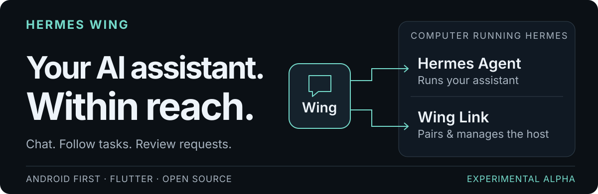
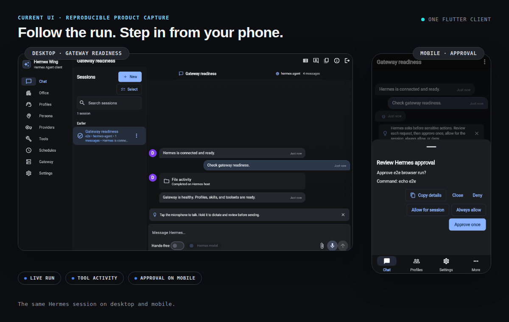

# Hermes Wing

**A Flutter port of Hermes Desktop for desktop, web and Android.**
Chat, follow its work, and review requests for permission in a visual app.
Hermes Desktop guides welcome, navigation, terminology, layout, interaction and
daily-use behavior. Flutter adaptations must preserve that experience and record
necessary differences. Hermes Agent remains the backend authority.
Full parity remains a target, not current support. The official reference is
`hermes-agent/apps/desktop/`. Earlier comparisons used the wrong application and
are [withdrawn as parity evidence](docs/quality/official-desktop-reference.md).

> [!NOTE]
> **Early alpha · technical setup required.** The main getting-started path needs
> a Wing build, a reachable Hermes Agent and access to an AI provider.
> There is no app-store installation yet.

**Wing Link is deprecated and is not required to use Wing.** The accepted Local / SSH / Remote
flow connects directly to Hermes Agent. The current development worktree shows
**Get Started** and SSH/Remote actions on a Desktop-guided fresh-launch welcome.
Chat keeps **Add Hermes**. Legacy setup/pairing remains in code pending removal. The
[welcome receipt](docs/quality/desktop-welcome.md) records widget/Chromium checks,
not Android or main delivery. The [welcome recovery receipt](docs/quality/desktop-welcome-recovery.md)
adds isolated Linux GTK cancellation, explicit retry and fresh-process restoration.
Its endpoint store is synthetic, not physical keychain qualification. The [first-run receipt](docs/quality/direct-first-run.md)
records passing widget and compiled-browser checks on Linux, not delivery to main.
The [native first-run receipt](docs/quality/direct-first-run-native.md) also records
passing deterministic Linux GTK journeys. Live authentication, Android and main
delivery remain separate. Managed native SSH with key/password controls is
implemented in the current source; native full-app qualification remains open.
Linux Hermes-home directory inspection and Android **This phone** guidance are
also implemented. Native discovery/chooser, same-phone installation and
background-hosting qualification remain open. See the
[deprecation decision](docs/adr/product.md#wing-link-deprecation).
See the [direct connection steps](docs/getting-started.md#direct-agent-connection).

**[Set up your first chat →](docs/getting-started.md)**

The next product priority is reliable away-and-return chat, clear job status,
then notifications—not more decorative screens. This is
[accepted delivery direction](docs/product/prd.md#user-demand-emphasis), not a claim
of qualified mobile background recovery or notification delivery.

  <picture>
    <source media="(max-width: 600px)" srcset="./assets/readme/overview-mobile.svg">
    
  </picture>

## What is Hermes Agent?

[Hermes Agent](https://github.com/NousResearch/hermes-agent) is open-source
software for running a personal AI assistant. An **agent** can take actions as
well as write replies—for example, working with files or running commands when
you have configured the necessary tools and permissions.

**Hermes Wing is the app you use to talk to it.** You do not need prior Hermes
knowledge. The setup guide links to official Agent installation and provider setup.

| Piece | Its job |
| --- | --- |
| **Wing** | The app you open to chat and follow work. |
| **Hermes Agent** | Runs the assistant and keeps its conversations on your computer. |
| **Wing Link** | Deprecated legacy integration, still present pending removal. Not needed for direct Agent use. |

Chat goes directly from Wing to Hermes Agent, separately from Wing Link.
Hermes remains the source of truth.

## What can I do with it?

Start with a conversation:

> Help me turn my website idea into three practical steps. Ask me what you need to know first.

Answer its questions, then follow up with “Turn the first step into a checklist.”
You can return to the conversation later.

- **Chat and follow progress.** Read replies as they arrive and see tool activity.
- **Stay in control.** Review permission requests when Hermes sends them, or stop
  the current task.
- **Keep assistant setups separate.** Switch between named configurations,
  called **profiles**. Start with **Default**.

  <picture>
    <source media="(max-width: 600px)" srcset="./assets/readme/showcase-mobile.png">
    
  </picture>

*Actual app screens with sample conversations and simulated responses.*

## What do I need for the Android setup guide?

- **A reachable, authenticated Hermes Agent.** It can run on another computer.
  Guided same-phone Android setup is not qualified yet.
- **An Android phone and the tools to build Wing.** The guide explains the
  requirements; someone comfortable with terminal commands may need to help.
- **An AI provider and model.** The provider supplies the AI service; the model
  generates replies. Hermes' setup wizard helps you configure them.
- **A trusted connection to Agent.** NetBird or Tailscale can provide private
  connectivity, but neither VPN nor management pairing is mandatory. Browser
  access requires trusted HTTPS and permitted CORS; native remote access must
  satisfy the existing transport review.

Wing is [MIT-licensed](LICENSE). **AI access and credits are not included**;
providers may charge and process conversation data. Hosting Hermes yourself does
not automatically keep every AI request local.

## Your first chat on Android

1. **Build and open Wing.** Prepare a reachable, authenticated Hermes Agent.
   Configure the provider in Hermes, not through a mandatory Wing Link install.
2. **Open direct connection.** On a fresh launch, choose **Get Started** for Local,
   **Connect via SSH**, or **Connect to Remote Hermes**. With a saved connection,
   choose **Add Hermes** from Chat. None of these direct paths requires pairing.
3. **Connect to Agent.** Enter its approved endpoint and profile-bound credential.
   This path grants no Wing Link management access.
4. **Open the configured profile and send a message:** “Reply with one sentence introducing
   yourself. Do not use any tools.” A reply confirms chat works. Try a follow-up.

**[Follow the step-by-step setup guide →](docs/getting-started.md)**

Already running Hermes? Start with the [direct connection steps](docs/getting-started.md#direct-agent-connection).

Just looking? [Try the web alpha](https://trebuchetdynamics.github.io/hermes-wing/app/).
**Interface only—requires your own assistant to chat.** Browser connections also
need trusted HTTPS and permission for the Wing website to contact your computer;
see [browser connection help](docs/getting-started.md#need-help).

## Availability

Android is the most exercised client. Web and Linux are text-first alpha paths;
Windows, macOS, and iOS have build evidence but limited runtime qualification.
Voice remains experimental. Guided same-phone Android setup is the replacement
direction, not a qualified hosting path. An isolated, privately signed Android test APK has build and
artifact-check evidence; see the [private release handoff](docs/runbooks/android/release-handoff.md#private-release-apk-handoff).
Public signed distribution and automatic app updates remain unqualified.

The retained Termux installer still includes deprecated management setup. It is
not the new-user installation path. Follow supported Agent installation guidance;
[phone setup status](docs/getting-started.md#can-everything-run-on-the-phone-instead) records
the remaining replacement and qualification gap.

See [feature availability](docs/product/routes.md) and
[real Android chat test evidence](docs/quality/provider-chat-physical-2026-09-05.md)
for the tested scope.

## Need help?

Waydroid runs Android in a Linux container. It is the selected Android QA
environment, not a physical phone. Use the isolated QA app and
[Android qualification procedure](docs/runbooks/desktop-feature-qualification.md#android-maestro-fixture-run).
ADB connectivity is engineering setup; a running container alone does not prove
a test passed. Physical-device acceptance remains separate.

Cannot connect, or connected without a reply?
[Start with troubleshooting](docs/getting-started.md#need-help).
If you [report a problem](https://github.com/TrebuchetDynamics/hermes-wing/issues),
include your platform and what happened. Keep credentials, pairing links, and
private conversations out of reports.

[All documentation](docs/README.md) · [Technical design](docs/spec.md) ·
[Test plan](docs/test-plan.md) · [Task handoff](TODO.md) ·
[User-action blockers](BLOCKERS.md) · [Contributing](CONTRIBUTING.md) ·
[Roadmap](ROADMAP.md) · [Security](SECURITY.md) · [Changelog](CHANGELOG.md)

Hermes Wing is independent of NousResearch. Thanks to
[Hermes Agent](https://github.com/NousResearch/hermes-agent) for the runtime and
[Nous Research Hermes Desktop](https://github.com/NousResearch/hermes-agent/tree/main/apps/desktop)
as the product reference. Earlier separate-app comparisons remain withdrawn as parity evidence.
